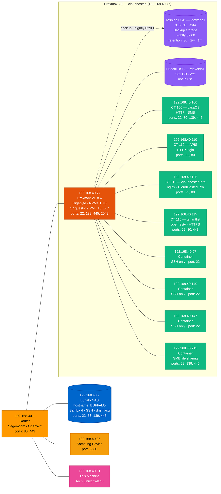

# Network Diagram — 192.168.40.0/24

Updated: 2026-06-06  
Source: nmap scan + manual verification

> Render in VS Code (Markdown Preview), GitHub, or Obsidian.

---

## Device Summary

| IP | Hostname | Type | Vendor | Ports | Notes |
|----|----------|------|--------|-------|-------|
| 192.168.40.1 | — | Router | Sagemcom Broadband SAS | 80, 443 | OpenWrt gateway |
| 192.168.40.9 | BUFFALO | NAS | Buffalo Inc | 22, 53, 139, 445 | Samba 4 · dnsmasq · SSH |
| 192.168.40.35 | — | IoT | Samsung Electronics | 8080 | Smart TV or Android device |
| 192.168.40.51 | — | This machine | — | — | Arch Linux · wlan0 |
| 192.168.40.67 | — | LXC container | Proxmox | 22 | OpenSSH 10.0 (Debian trixie) |
| 192.168.40.77 | cloudhosted | Proxmox host | Gigabyte | 22, 139, 445, 2049 | PVE 8.4 · NVMe 1 TB · 17 guests |
| 192.168.40.100 | — | LXC container | Proxmox | 22, 80, 139, 445 | CT 100 · CasaOS |
| 192.168.40.110 | — | LXC container | Proxmox | 22, 80 | CT 110 · APIS |
| 192.168.40.115 | — | LXC container | Proxmox | 22, 80, 443 | CT 115 · openresty · HTTPS |
| 192.168.40.125 | — | LXC container | Proxmox | 22, 80 | CT 111 · cloudhosted.pro · nginx |
| 192.168.40.140 | — | LXC container | Proxmox | 22 | SSH only |
| 192.168.40.147 | — | LXC container | Proxmox | 22 | SSH only |
| 192.168.40.215 | — | LXC container | Proxmox | 22, 139, 445 | SMB file sharing (not the NAS) |

---

## Proxmox Guests Not Visible on This Subnet

Configured on Proxmox but did not appear in the scan (stopped, NAT'd, or bridged separately):

| VMID | Name | Type | Disk |
|------|------|------|------|
| 101 | microservices | LXC | 100 GB |
| 102 | CRM | LXC | 35 GB |
| 103 | DNS | LXC | 15 GB |
| 104 | clinic | LXC | 11 GB |
| 105 | candles | LXC | 20 GB |
| 106 | AI | VM | 150 GB |
| 107 | mail | LXC | 20 GB |
| 108 | photos | LXC | 30 GB |
| 109 | portainer | LXC | 12 GB |
| 112 | Template | LXC | 10 GB |
| 113 | apisApp | VM | 32 GB |
| 114 | pestleads | LXC | 40 GB |
| 116 | vananavan | LXC | 25 GB |

---

## Proxmox Backup

| Setting | Value |
|---------|-------|
| Storage | Toshiba USB `/dev/sda1` → `/mnt/pve/usb-toshiba` |
| Capacity | 916 GB ext4 |
| Schedule | Daily at 02:00 — all 17 guests |
| Compression | zstd · ~94 GB per full run |
| Retention | 3 daily · 2 weekly · 1 monthly |
| Notifications | angelcerceda@gmail.com |
